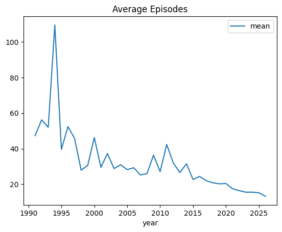
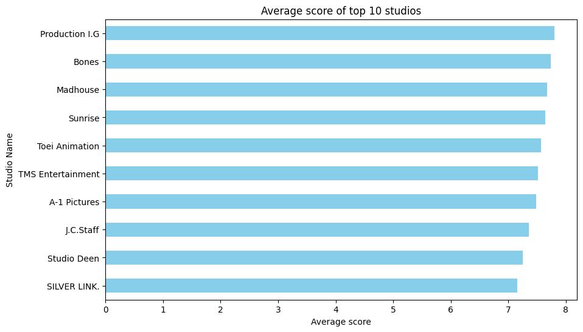
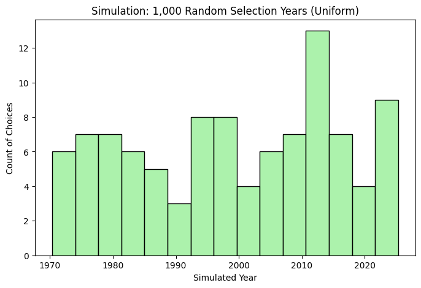
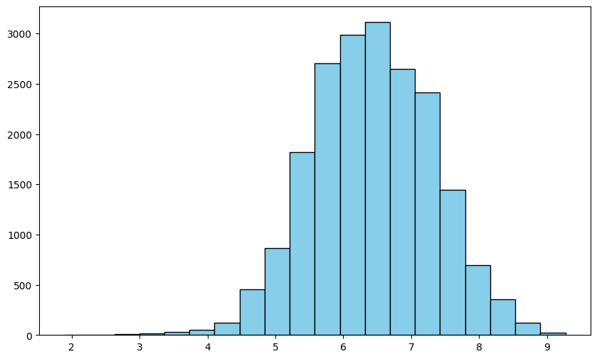
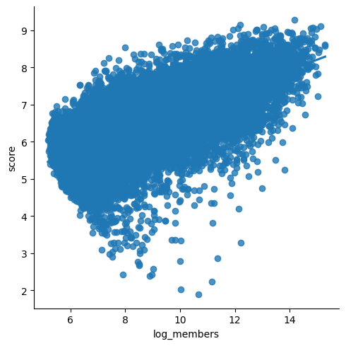
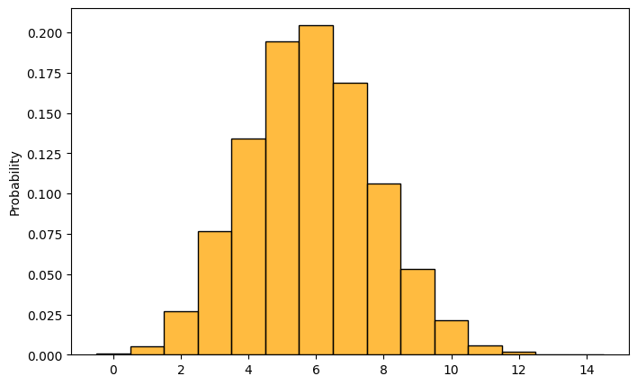

Anime Data Analysis Pipeline. 
Author: Iskandar Abdukhamidov
This script cleans, aggregates, and visualizes Kaggle anime data 
to uncover historical trends and studio performance metrics.

Several graphs represents performance of top anime studios, compares mean scores/# of anime episodes, calculates correlations. Some probabilities are calculated.

### 1. User Rating Distribution
Description of what this histogram shows about average anime episodes.

### 2. Average Scores of Top 10 Studios
Analysis of how studio sizes affect their overall average performance scores.

### 3. Simulation Modeling (Uniform Distribution)
Analysis of the 1,000 random selection year simulation.

### 4 Average Scores
Average scores for years

### 5 Score_Members Correlation
members column log transformed and correlated with scores 

### 6 Binomial Simulation 

